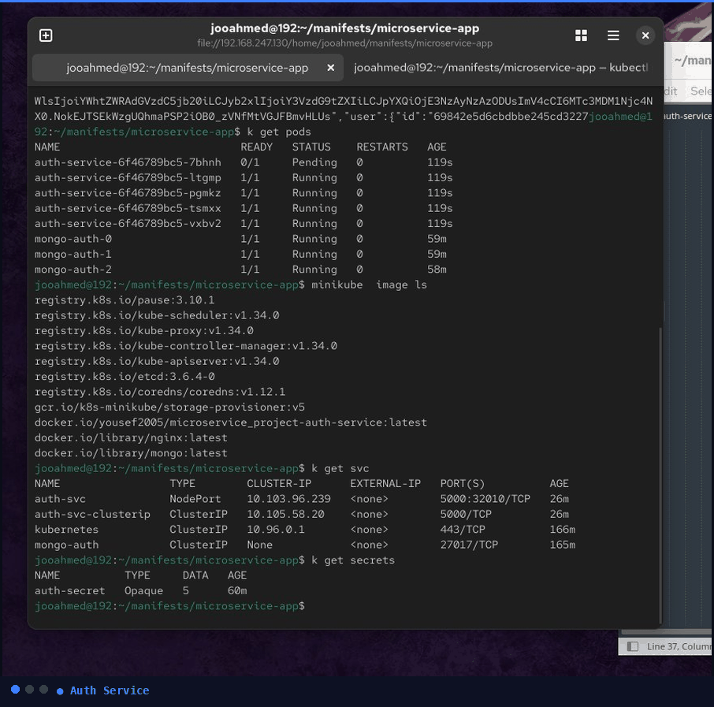

<div align="center">

<h1>
  
</h1>

<p>

</p>

<p><i>Not just a project — 6+ months of real hands-on DevOps practice covering containerization, orchestration, networking, CI/CD, and production-grade patterns.</i></p>

</div>

---

## 📁 Project Structure

```
Microservice_Project/
├── auth-service/          # Authentication & JWT service
├── cart-service/          # Shopping cart service
├── order-service/         # Order management service
├── products-service/      # Product catalog service
├── k8s/                   # Kubernetes manifests
│   ├── deployments/
│   ├── services/
│   ├── configmaps/
│   ├── secrets/
│   ├── ingress/
│   └── statefulsets/
├── .github/
│   └── workflows/         # CI/CD pipelines
├── docker-compose.yml
└── README.md
```

---

## 🐳 Docker — Multistage Best Practices

Each service uses a **multistage Dockerfile** to keep production images lean and secure.

| Practice | Reason |
|---|---|
| `node:20-alpine` base image | ~5MB vs ~900MB — faster push/pull |
| Copy `package.json` first | Docker layer cache skips `npm install` if deps unchanged |
| Multistage build | Final image has no dev dependencies or source code |
| Non-root user `appuser` | Limits blast radius if container is compromised |
| `npm ci` over `npm install` | Deterministic installs via `package-lock.json` |

---

## 🔄 CI/CD — GitHub Actions

Every push to `main` triggers an automated pipeline:

**Lint & Test → Build → Push to Docker Hub**

- Matrix strategy runs all 4 services in parallel
- Docker layer caching via GitHub Actions cache (`type=gha`)
- Images tagged with both `:latest` and the commit SHA

---

## 🐙 Docker Compose — Local Development

Single command to spin up all services locally:

```bash
docker compose up --build
```

| Service | Local Port |
|---|---|
| auth-service | 3001 |
| cart-service | 3002 |
| order-service | 3003 |
| products-service | 3004 |
| MongoDB | 27017 |

---

## ☸️ Kubernetes — What's Covered

| Topic | Details |
|---|---|
| Deployments | Replicas, rolling updates, resource limits |
| Health Probes | `/health` (liveness) + `/ready` (readiness) on every service |
| ConfigMaps & Secrets | Externalized config, base64-encoded secrets |
| Services | ClusterIP (internal) · NodePort (testing) · LoadBalancer (external) |
| StatefulSet | MongoDB with persistent volume claims |
| Blue-Green Deploy | Zero-downtime releases via service selector switch |
| Ingress + TLS | Nginx ingress controller, self-signed cert for local HTTPS |

---

## 🌐 Networking Overview

```
External Traffic
      │
      ▼
┌─────────────┐
│   Ingress   │  ← Nginx · TLS termination · path-based routing
└──────┬──────┘
       │
       ▼
┌─────────────────────────────────────────┐
│           Kubernetes Cluster             │
│  auth  ◄──ClusterIP──► cart             │
│    └──────────► MongoDB StatefulSet      │
└─────────────────────────────────────────┘
```

---

## 🛠️ Local Setup — Minikube

```bash
minikube start --memory=4096 --cpus=2

kubectl apply -f k8s/configmaps/
kubectl apply -f k8s/secrets/
kubectl apply -f k8s/statefulsets/
kubectl apply -f k8s/deployments/
kubectl apply -f k8s/services/
kubectl apply -f k8s/ingress/

minikube tunnel      # expose LoadBalancer
minikube dashboard   # visual overview
```

---

## 📊 Services Overview

| Service | Port | Docker Hub |
|---|---|---|
| `auth-service` | 3001 | `jooahmed/auth-service` |
| `cart-service` | 3002 | `jooahmed/cart-service` |
| `order-service` | 3003 | `jooahmed/order-service` |
| `products-service` | 3004 | `jooahmed/products-service` |

---

## 🗺️ Roadmap — What's Next

### ☁️ Cloud & Infrastructure
- [ ] Deploy to a real cloud provider (AWS / GCP / Azure)
- [ ] Infrastructure as Code with **Terraform** — provision VMs, VPCs, and K8s clusters
- [ ] Managed Kubernetes on cloud (EKS / GKE / AKS)

### 🔧 CI/CD Upgrade
- [ ] Migrate pipelines to **Jenkins** — self-hosted CI/CD server
- [ ] Jenkins shared libraries for reusable pipeline logic
- [ ] Parallel stages and multi-branch pipelines in Jenkins

### 🔐 Secrets Management
- [ ] **HashiCorp Vault** — dynamic secrets, secret leasing, and revocation
- [ ] Vault + Kubernetes integration (Vault Agent Injector)
- [ ] Replace hardcoded K8s Secrets with Vault-backed secrets

### 📈 Observability
- [ ] Prometheus + Grafana monitoring stack
- [ ] Horizontal Pod Autoscaler (HPA)
- [ ] Distributed tracing with Jaeger

---

## 👤 About

**Joe Ahmed** — DevOps enthusiast documenting a real 6-month learning journey.

> *"This repo isn't just a project — it's a living record of daily practice, real mistakes, and genuine growth in the DevOps field."*

<div align="center">

[]([https://github.com/jooahmed](https://github.com/Yousefa7medmaher))
[](https://hub.docker.com/repositories/yousef2005)

</div>
