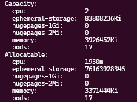
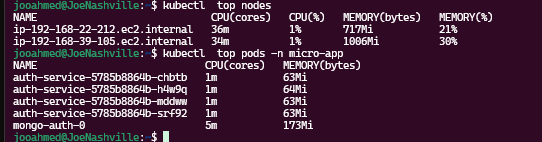
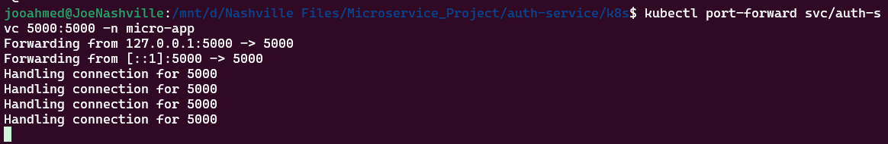
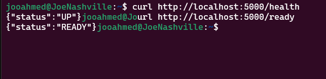
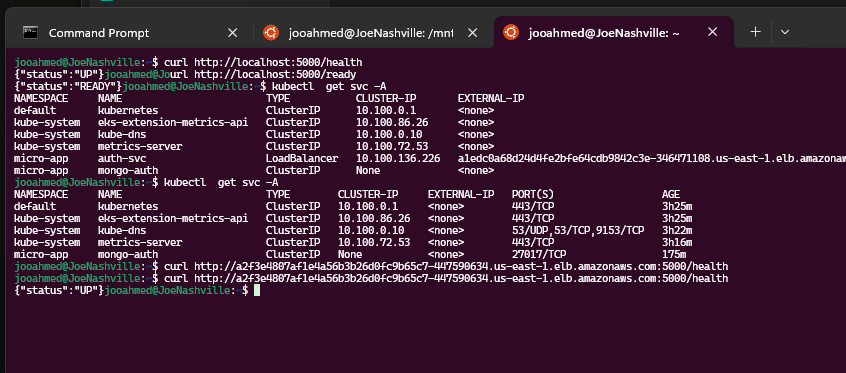
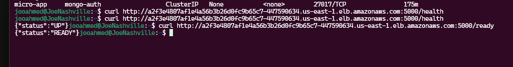
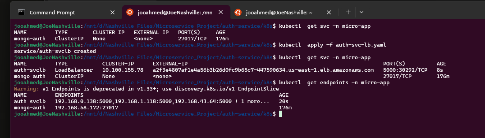
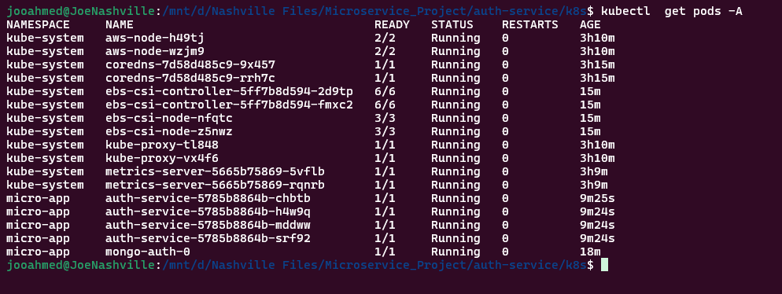

<div align="center">

<h1>
  
</h1>

<p><i>Not just a project — 6+ months of real hands-on DevOps practice covering containerization, orchestration, networking, CI/CD, and production-grade patterns.</i></p>

</div>

---

## 📁 Project Structure

```
Microservice_Project/
├── auth-service/
├── cart-service/
├── order-service/
├── products-service/
└── README.md
```

---

## 🐳 Docker — Multistage Best Practices

Each service uses a **multistage Dockerfile** to keep production images lean and secure.

| Practice | Reason |
|---|---|
| `node:20-alpine` base image | ~5MB vs ~900MB — faster push/pull |
| Copy `package.json` first | Docker layer cache skips `npm install` if deps unchanged |
| Multistage build | Final image has no dev dependencies or source code |
| Non-root user `appuser` | Limits blast radius if container is compromised |
| `npm ci` over `npm install` | Deterministic installs via `package-lock.json` |

---

## 🔄 CI/CD — GitHub Actions + AWS ECR + EKS

Every push to `main` triggers an automated pipeline across all services.

### CI — Build & Push to ECR

**Lint & Test → Build → Push to Amazon ECR**

- Matrix strategy runs all services in parallel
- Docker layer caching via GitHub Actions cache (`type=gha`)
- Images tagged with both `:latest` and the commit SHA
- Pushes to a private ECR repository per service

### CD — Deploy to EKS (Reusable Workflow)

A reusable `workflow_call` workflow handles all deployments:

```yaml
# Example: calling the reusable CD workflow
uses: ./.github/workflows/cd-deploy-eks.yml
with:
  image_tag: ${{ github.sha }}
  environment: production
  cluster_name: my-eks-cluster
  namespace: micro-app
  service_name: auth-service
  repo_name: auth-service
secrets: inherit
```

**What the CD workflow does:**

1. Configures AWS credentials
2. Installs `kubectl` and updates kubeconfig via `aws eks update-kubeconfig`
3. Replaces `IMAGE_PLACEHOLDER` in manifests with the real ECR image URI
4. Applies manifests with `kubectl apply -f k8s/ -n $NAMESPACE`
5. Verifies rollout with `kubectl rollout status`

---

## ☁️ Infrastructure — Terraform + AWS EKS

The EKS cluster is provisioned with Terraform. Kept minimal for free-tier usage:

- Minimal node count and instance sizes to stay within free-tier limits
- Resource requests and limits set on all pods to avoid over-scheduling
- EBS CSI driver enabled for persistent volumes (MongoDB)
- Metrics server deployed for resource visibility

**Allocatable resources per node:**



**Pod CPU & memory usage:**



---

## ☸️ Kubernetes — What's Covered

| Topic | Details |
|---|---|
| Deployments | Replicas, rolling updates, resource limits |
| Health Probes | `/health` (liveness) + `/ready` (readiness) on every service |
| ConfigMaps & Secrets | Externalized config, base64-encoded secrets |
| Services | ClusterIP (internal) · LoadBalancer (external/production) |
| StatefulSet | MongoDB with persistent volume claims |
| Ingress | Manifest ready, not yet applied in current deployment |

### Health & Readiness Endpoints

Every service exposes `/health` and `/ready`. Verified via port-forward locally and via the LoadBalancer externally.

**Port-forward test (local):**





**LoadBalancer test (production):**





### LoadBalancer — Production Access

Using `type: LoadBalancer` instead of Ingress for now (Ingress manifest is ready but not yet applied). The `auth-svc` LoadBalancer is provisioned on AWS ELB automatically.

**Service + endpoints verification:**



### All Pods Running



---

## 🌐 Networking Overview

```
External Traffic
      │
      ▼
┌──────────────────┐
│  AWS LoadBalancer │  ← ELB provisioned per service (production)
└────────┬─────────┘
         │
         ▼
┌────────────────────────────────────────┐
│           EKS Cluster (micro-app ns)    │
│  auth-service (x4 pods)                │
│       └──ClusterIP──► mongo-auth        │
└────────────────────────────────────────┘
```

> Ingress + path-based routing is the next step — manifest already exists.

---

## 🐙 Docker Compose — Local Development

```bash
docker compose up --build
```

| Service | Local Port |
|---|---|
| auth-service | 3001 |
| cart-service | 3002 |
| order-service | 3003 |
| products-service | 3004 |
| MongoDB | 27017 |

---

## 📊 Services Overview

| Service | Port | ECR Repo |
|---|---|---|
| `auth-service` | 5000 | `<account>.dkr.ecr.us-east-1.amazonaws.com/auth-service` |
| `cart-service` | 3002 | `<account>.dkr.ecr.us-east-1.amazonaws.com/cart-service` |
| `order-service` | 3003 | `<account>.dkr.ecr.us-east-1.amazonaws.com/order-service` |
| `products-service` | 3004 | `<account>.dkr.ecr.us-east-1.amazonaws.com/products-service` |

---

## 🗺️ Roadmap — What's Next

### ☁️ Infrastructure
- [x] Deploy to AWS EKS
- [x] Provision cluster with Terraform
- [ ] Ingress controller with path-based routing
- [ ] Multi-environment support (staging / prod)

### 🔧 CI/CD
- [x] GitHub Actions — CI push to ECR
- [x] GitHub Actions — CD deploy to EKS (reusable workflow)
- [ ] Migrate to Jenkins self-hosted

### 🔐 Secrets
- [ ] HashiCorp Vault integration
- [ ] Replace K8s Secrets with Vault-backed secrets

### 📈 Observability
- [ ] Prometheus + Grafana
- [ ] Horizontal Pod Autoscaler (HPA)

---

## 👤 About

**Joe Ahmed** — DevOps enthusiast documenting a real 6-month learning journey.

> *"This repo isn't just a project — it's a living record of daily practice, real mistakes, and genuine growth in the DevOps field."*

<div align="center">

[](https://github.com/Yousefa7medmaher)
[](https://hub.docker.com/repositories/yousef2005)

</div>
